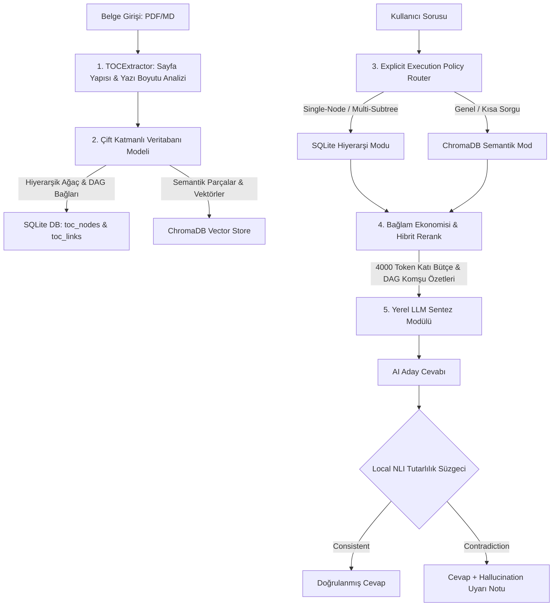

# 🛡️ Aegis RAG: Proje Beyni (Project Brain)

Bu belge, **Aegis RAG (Frontier Local Document Intelligence)** projesinin tüm tasarım kararlarını, mimari akışını, veritabanı yapısını, çözülen kritik üretim hatalarını ve yol haritasını bir arada tutan merkezi referans kılavuzudur.

---

## 🧭 1. Proje Kimliği ve Temel Vizyon

Aegis RAG; bulut bağımlılığı olmayan, tamamen yerel donanımda (CPU/GPU) çalışan, **PageIndex (Yapısal Ağaç)** orkestrasyonu ile **Semantik RAG** katmanlarını birleştiren çift hatlı bir yerel bilgi işletim sistemidir.

* **Donanım Hedefi:** 16GB RAM, yerel CPU veya düşük bütçeli tüketici GPU'su.
* **Hız Hedefi:** Veritabanı seviyesinde sorgu eşleştirme latansı < 1.0 ms.
* **Güvenlik Hedefi:** LLM halüsinasyonlarını engelleyen sıfır bağımlılıklı yerel doğrulama (Local NLI).
* **Modeller:**
  - Dil Modeli (LLM): `qwen2.5:7b-instruct` (Ollama üzerinden)
  - Vektör Modeli (Embedding): `nomic-embed-text:latest` (Ollama üzerinden)

---

## 🏗️ 2. Çalışma ve Mimari Akışı

Sistem, bir belgenin yüklenmesinden kullanıcının sorusunun yanıtlanmasına kadar **5 temel katmanda** çalışır:



---

## 🛠️ 3. Çözülen Kritik Üretim Hataları (Resolved Bugs)

Projenin geliştirilmesi sırasında yerel Windows ortamında karşılaşılan ve çözülen kritik sorunlar ve mühendislik yaklaşımları:

### 🔴 Hata 1: Soket Bağlantı Çakışması (WinError 10013 - CLOSE_WAIT)
* **Semptom:** FastAPI backend başlatılmaya çalışıldığında `Erişim izinlerince izin verilmeyen bir şekilde bir yuvaya erişilmeye çalışıldı` hatası alınıyor ve Streamlit arayüzünde "Backend Hata" gösteriliyordu.
* **Teşhis:** Windows üzerinde `8000` portunu tutan ancak yanıt vermeyen bir zombie Python süreci (PID `30500`) soketi `CLOSE_WAIT` durumunda kilitli bırakmıştı.
* **Çözüm:** Tüm sistem yapılandırmaları (`app.py`, `run_aegis.bat` ve başlatma parametreleri) çakışmasız çalışan **`8002`** portuna taşındı. Ayrıca local isteklerin DNS çözümlemesinde IPv6 çakışması yaşamaması için `localhost` yerine kararlı IPv4 adresi olan **`127.0.0.1`** adresi sabitlendi.

### 🔴 Hata 2: PDF Parser Başlık Aşırı-Bölümleme (Over-Segmentation) Hatası
* **Semptom:** 3.9 MB'lık bir roman yüklendiğinde veritabanında **3.325 adet düğüm** oluşuyor, neredeyse tüm düğümlerin içerik uzunluğu **0 byte** kalıyor ve LLM *"Mevlut hakkında belgede bilgi yoktur"* diyordu.
* **Teşhis:** `TOCExtractor` sınıfı, gövde yazı boyutunu belirlemek için sadece ilk 5 sayfayı örnekliyordu. Romanın ilk 5 sayfası telif/künye sayfaları olduğundan küçük fontluydu (`8.0` boyutunda). Romanın asıl hikaye sayfaları ise `10.5` boyutundaydı. Parser, `10.5 > 8.0 + 1.5` kuralından ötürü **romandaki tüm normal paragrafları başlık sanarak** `###` ile işaretledi. Kitap binlerce boş düğüme bölündü ve metin içeriği kayboldu.
* **Çözüm:** Yazı boyutu analiz algoritması güncellendi. İlk 5 sayfa yerine, belgenin ortasından (%10'luk kısımdan sonrası) **eşit aralıklarla dağıtılmış 10 sayfa** örneklenerek gerçek gövde yazı boyutu (`10.5`) hatasız tespit edildi. Paragrafların başlık sanılması engellendi, düğüm sayısı 3.325'ten anlamlı hiyerarşik başlıklara düştü ve içerikler başarıyla SQLite'a yazıldı.

### 🔴 Hata 3: Sağlık Kontrolü Zaman Aşımı (Read Timeout) Hatası
* **Semptom:** Arayüz düzgün çalışırken bir süre sonra veya ilk açılışta `Read timed out. (read timeout=3)` hatası ile sistem durumu kırmızıya ("Backend Hata") dönüyordu.
* **Teşhis:** Arayüzün sağlık kontrolü zaman aşımı süresi `3 saniye` idi. Backend `/api/health` fonksiyonu ise Ollama'ya mükerrer (iki kez) istek gönderiyordu. Yerel Ollama modeli listelemek için `2.1 saniye` harcadığından, backend'in yanıt vermesi `4.2 saniye` sürüyor ve arayüz 3. saniyede bağlantıyı kesip hata veriyordu.
* **Çözüm:** 
  1. Backend API sağlık kontrolü optimize edildi; Ollama'ya yapılan mükerrer istekler teke indirilerek `timeout=2.5` sınırı konuldu.
  2. Streamlit arayüzündeki sağlık kontrolü zaman aşımı süresi yerel donanım gecikmelerini tolere etmek için **10 saniyeye** çıkarıldı.

---

## 📂 4. Proje Dizin Yapısı ve Dosya Rehberi

Projenin kaynak kodları masaüstündeki [aegis-rag](file:///C:/Users/mete_/Desktop/aegis-rag) klasöründedir:

* **[run_aegis.bat](file:///C:/Users/mete_/Desktop/aegis-rag/run_aegis.bat)**: Sistemi (Ollama, API ve UI) tek tıkla başlatan Windows batch betiği.
* **[src/ui/app.py](file:///C:/Users/mete_/Desktop/aegis-rag/src/ui/app.py)**: Streamlit premium koyu temalı kullanıcı arayüzü. İlerleme çubuğu, anlamsal ısı haritası ve karar günlüğü (Tree Trace) panellerini yönetir.
* **[src/backend/main.py](file:///C:/Users/mete_/Desktop/aegis-rag/src/backend/main.py)**: FastAPI sunucusu. Deterministik yönlendirme, bağlam ekonomisi ve NLI doğrulama katmanlarını barındırır.
* **[src/parser/toc_extractor.py](file:///C:/Users/mete_/Desktop/aegis-rag/src/parser/toc_extractor.py)**: Gelişmiş layout-aware PDF/Markdown okuyucu ve TOC hiyerarşi çıkarıcı.
* **[src/database/db_manager.py](file:///C:/Users/mete_/Desktop/aegis-rag/src/database/db_manager.py)**: SQLite (Graf ilişkileri ve düğüm çıpaları) ile ChromaDB (embedding arama) entegrasyon yöneticisi.
* **[tests/benchmark_suite.py](file:///C:/Users/mete_/Desktop/aegis-rag/tests/benchmark_suite.py)**: Sistemin her katmanını milisaniyeler bazında izole test eden ve `aegis_benchmark_report.md` üreten test modülü.
* **[db/](file:///C:/Users/mete_/Desktop/aegis-rag/db/)**: Yerel SQLite veritabanı (`aegis_rag.db`) ve ChromaDB vektör dizininin tutulduğu klasör.

---

## 🚀 5. Doğrulama ve Çalıştırma

### Sistemi Başlatma
Masaüstündeki **`run_aegis.bat`** dosyasını çift tıklayarak çalıştırabilirsiniz. Bu dosya sırasıyla:
1. Ollama servisinin çalışıp çalışmadığını kontrol eder (çalışmıyorsa başlatır).
2. FastAPI backend sunucusunu `127.0.0.1:8002` adresinde başlatır.
3. Streamlit arayüzünü `http://localhost:8501` adresinde ayağa kaldırır.

### Performans Analizi (Benchmark)
Tüm sistem bileşenlerinin hız bütçesini, arama isabetini ve sıkıştırma kalitesini ölçmek için masaüstü dizininde terminalden şu komutu çalıştırabilirsiniz:
```powershell
python tests/benchmark_suite.py
```
Bu komut, yerel donanımda izole testleri koşturacak ve performans raporunu güncelleyecektir.
